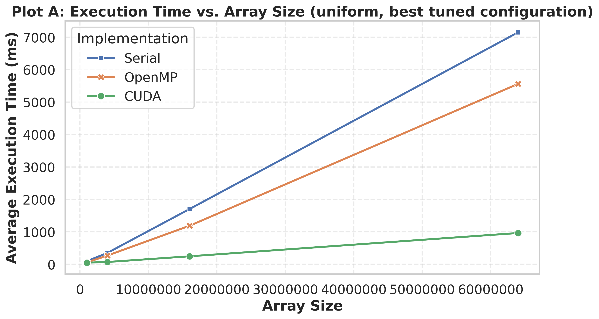
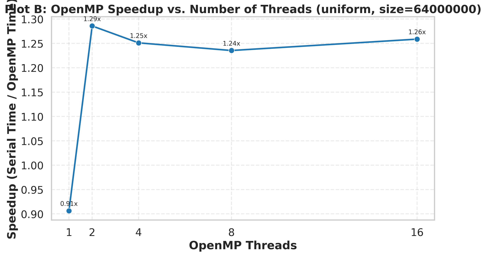
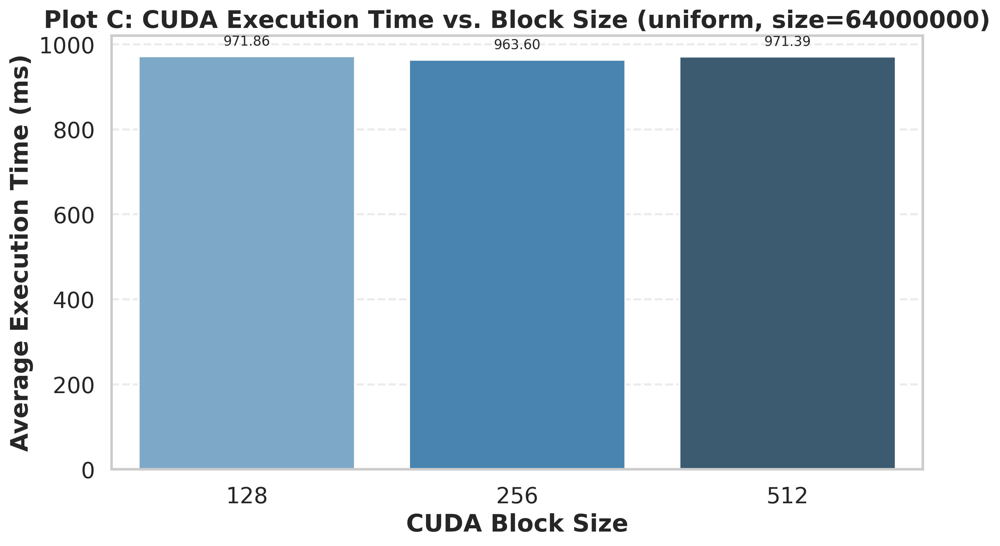

# Project 2 Report Template

## Title

**OpenMP MergeSort vs CUDA Bitonic Sort: Performance Analysis on Multicore CPU and GPU**

**Student Name:** `[Your Name]`  
**Course / Section:** `[Course Name]`  
**Instructor:** `[Instructor Name]`  
**Submission Date:** `[Date]`

---

## Abstract

`[Write a 1-paragraph summary of the project goals, the platforms tested, the main performance findings, and the final conclusion.]`

---

## 1. Introduction

### 1.1 Problem Statement

`[Describe the goal of comparing Serial std::sort, OpenMP MergeSort, and CUDA Bitonic Sort for large integer arrays.]`

### 1.2 Objectives

- `[Measure execution time across multiple array sizes.]`
- `[Evaluate OpenMP scaling as thread count increases.]`
- `[Evaluate CUDA sensitivity to block size.]`
- `[Interpret performance trends using HPC concepts such as parallelism, memory hierarchy, and synchronization overhead.]`

---

## 2. Experimental Environment

### 2.1 Hardware and Software

Use the logged system metadata from [system_info.txt](/home/mahmoud/HPC/project2-sort/results/system_info.txt).

- **CPU:** `[Fill from system_info.txt]`
- **GPU:** `[Fill from system_info.txt]`
- **OS:** `[Fill from system_info.txt]`
- **Compiler:** `[Fill from system_info.txt]`
- **CUDA Toolkit / Driver:** `[Fill from system_info.txt]`

### 2.2 Build and Runtime Configuration

- **Build type:** `[Release / compiler flags]`
- **Input distributions tested:** `[uniform / gaussian / nearly_sorted / reversed]`
- **Array sizes tested:** `[List sizes]`
- **OpenMP thread counts:** `[List counts]`
- **CUDA block sizes:** `[128, 256, 512]`
- **Repetitions per experiment:** `[e.g. 5]`

---

## 3. Methodology

### 3.1 Algorithms

#### Serial Baseline

`[Describe the use of std::sort as a correctness and performance baseline.]`

#### OpenMP MergeSort

`[Explain the recursive task-based decomposition, merge step, and tunable cutoff threshold.]`

#### CUDA Bitonic Sort

`[Explain the power-of-two padding strategy, shared-memory fast path, and later global-memory bitonic merge stages.]`

### 3.2 Measurement Procedure

`[Explain how average runtime was computed, how correctness was verified, and how results.csv was produced.]`

---

## 4. Results

### 4.1 Plot A: Execution Time vs. Array Size



**Observation Notes**

`[Discuss which implementation is fastest at small, medium, and large sizes.]`

### 4.2 Plot B: OpenMP Speedup vs. Number of Threads



**Observation Notes**

`[Discuss speedup trend, saturation, diminishing returns, and whether scaling is close to linear.]`

### 4.3 Plot C: CUDA Execution Time vs. Block Size



**Observation Notes**

`[Discuss which block size performed best and why occupancy, memory coalescing, and synchronization may matter.]`

---

## 5. Discussion

### 5.1 Why Bitonic Scales Differently than MergeSort

`[Use this section explicitly to compare algorithmic and architectural behavior.]`

- **Algorithmic complexity:** `[Compare MergeSort O(n log n) with Bitonic Sort O(n log^2 n).]`
- **Target hardware:** `[Explain why MergeSort fits CPU task parallelism while Bitonic is designed for regular GPU parallel patterns.]`
- **Memory behavior:** `[Discuss cache behavior on CPU vs shared/global memory behavior on GPU.]`
- **Synchronization cost:** `[Explain task overhead in OpenMP and stage/barrier overhead in CUDA bitonic passes.]`
- **Padding overhead:** `[Describe how non-power-of-two input sizes add extra work to Bitonic Sort.]`
- **Tuning sensitivity:** `[Discuss how cutoff size affects OpenMP and block size affects CUDA.]`

### 5.2 Performance Tradeoffs

`[Summarize when each implementation is preferable and why.]`

### 5.3 Unexpected Findings

`[Record anomalies, bottlenecks, or results that differed from expectations.]`

---

## 6. Limitations and Threats to Validity

- `[GPU availability, thermal throttling, OS scheduling, dataset randomness, measurement noise, memory limits, or missing architecture-specific tuning.]`
- `[Mention if CUDA could not be tested on the same machine as CPU experiments.]`
- `[Mention whether I/O and data generation were excluded from timing.]`

---

## 7. Conclusion

`[Write a short conclusion summarizing the main findings and what they imply about CPU vs GPU sorting for this workload.]`

---

## 8. Appendix

### 8.1 Reproduction Commands

```bash
bash run_experiments.sh
python3 plot_results.py --input results/results.csv --output-dir results/plots
```

### 8.2 Result Files

- `results/results.csv`
- `results/system_info.txt`
- `results/plots/plot_a_execution_time_vs_array_size.png`
- `results/plots/plot_b_openmp_speedup_vs_threads.png`
- `results/plots/plot_c_cuda_execution_time_vs_block_size.png`
